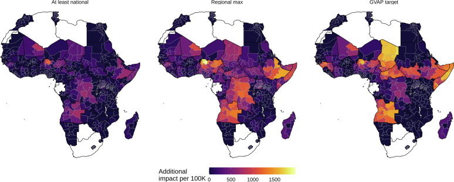
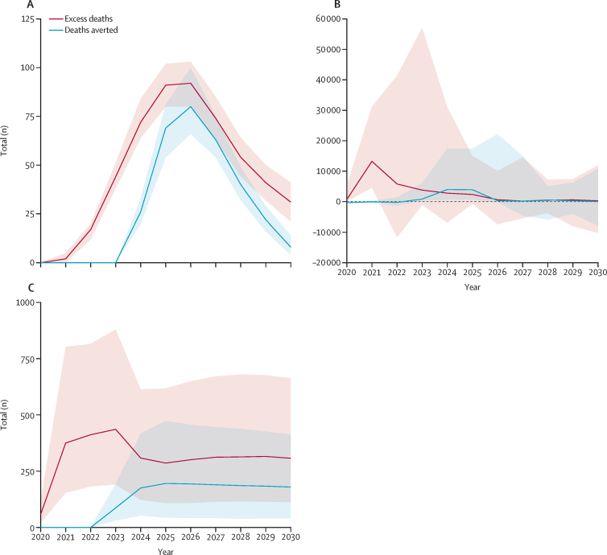
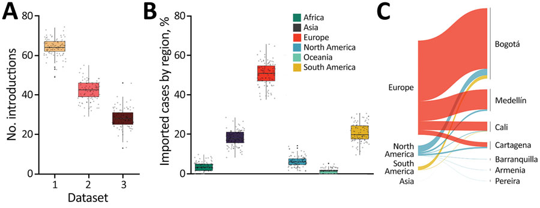
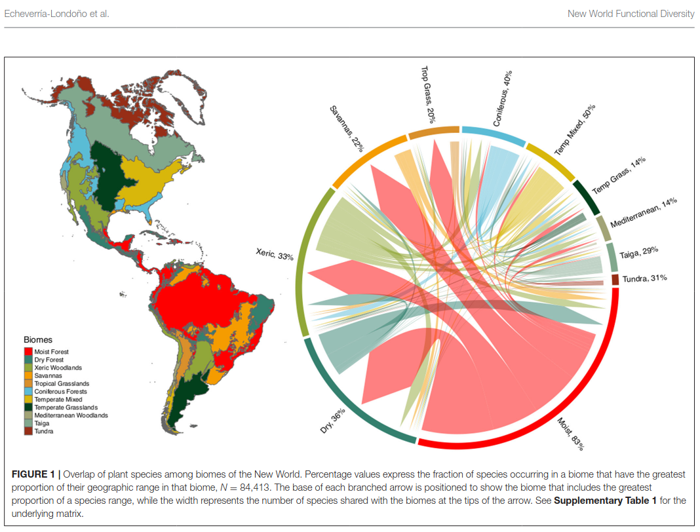
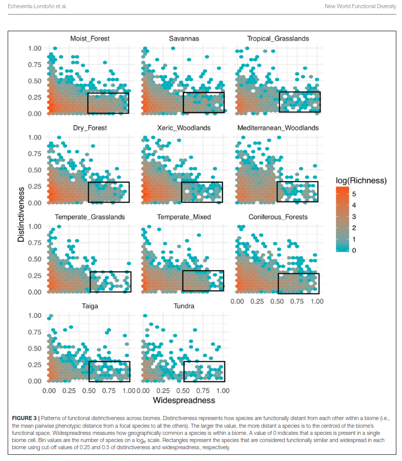
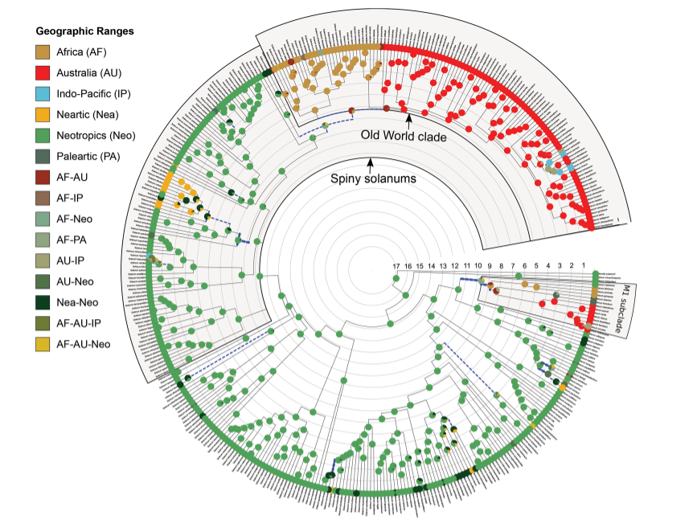
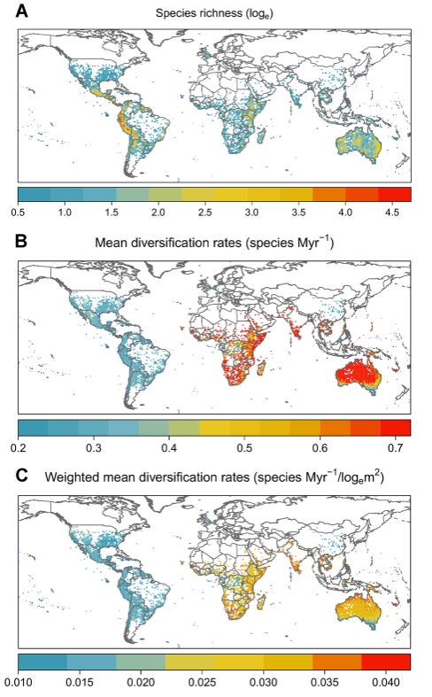
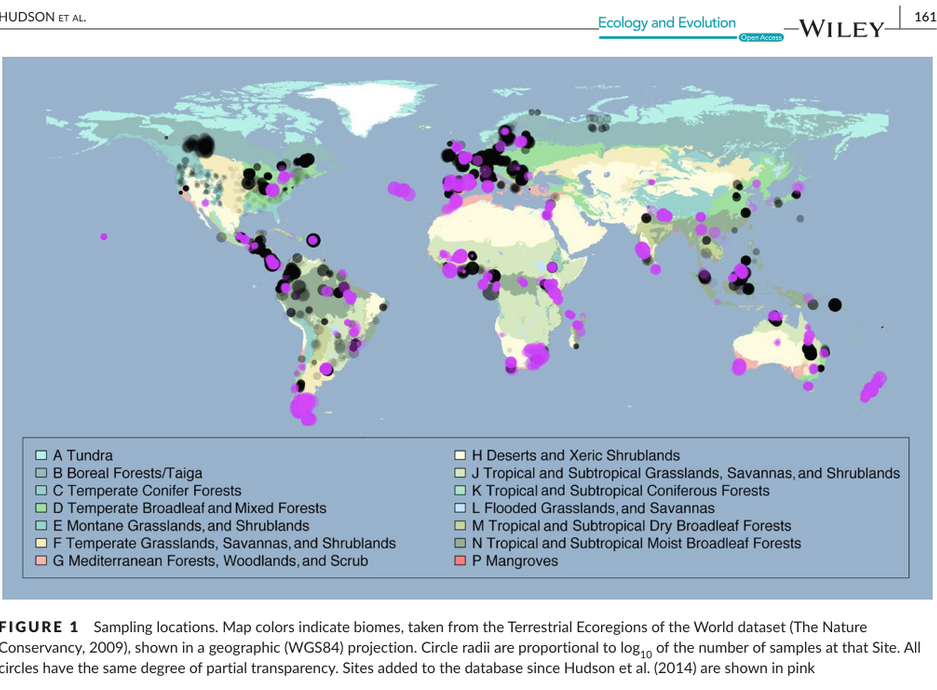
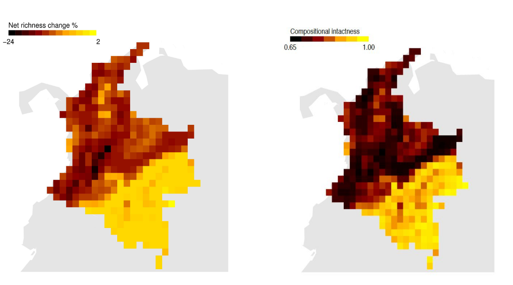

This page highlights a selection of research projects where I combined **large-scale data integration** with **statistical modelling** in the fields of public-health, ecology and evolution. 

---

## Vaccine Impact Modelling Consortium (VIMC) and COVID-19 genomic epidemiology
**Subtitle:** Quantifying lives saved by vaccination and understanding disruption and pathogen spread

### Summary
Across the Vaccine Impact Modelling Consortium (VIMC), I contributed to model-based evaluations of vaccination impact for multiple pathogens and countries, including work on disruptions during COVID-19 and on heterogeneity and inequality in impact. In parallel, during the early pandemic I contributed to genomic epidemiology of SARS‑CoV‑2 in Colombia, integrating flight data and phylogeographic inference to reconstruct likely routes of introduction.

### My role & contributions
- Synthesised and compared vaccine-impact estimates across pathogens/countries; contributed to interpretation and communication of model outputs.
- Analysed coverage-disruption scenarios and mitigation (catch-up) strategies during the COVID-19 period.
- For SARS‑CoV‑2 in Colombia: led the geographic reconstruction of likely importation routes using air travel data and phylogenetic outputs.

### Selected papers
- Echeverría-Londoño, S. *et al.* (2021). How can the public health impact of vaccination be estimated? *BMC Public Health*. https://doi.org/10.1186/s12889-021-12040-9
- Toor, J. *et al.* (2021). Lives saved with vaccination for 10 pathogens across 112 countries in a pre-COVID-19 world. *eLife*. https://doi.org/10.7554/eLife.67635
- Hartner, A.-M. *et al.* (2024). Estimating the health effects of COVID-19-related immunisation disruptions in 112 countries during 2020–30. *The Lancet Global Health*. https://doi.org/10.1016/S2214-109X(23)00603-4
- Laiton-Donato, K. *et al.* (2020). Genomic epidemiology of SARS‑CoV‑2, Colombia. *Emerging Infectious Diseases*. https://doi.org/10.3201/eid2612.202969

### Figures (from publications)
{fig-alt="Change of deaths averted per 100,000 live births in 2019 under the different scenarios of inequality reduction." width=95%}

{fig-alt="Additional deaths and deaths averted by catch-up activities over time" width=95%}

{fig-alt="Potential routes of importation for SARS-CoV-2, Colombia." width=95%}

---

## Plant diversity across the Americas: functional biogeography and habitat evolution
**Subtitle:** Functional trait space, biome structure, and evolutionary diversity at continental scale

### Summary
Using large plant distribution and trait databases for the Americas, this work examines how **functional diversity** and **evolutionary diversity** vary across biomes and climatic gradients, and what these patterns imply about the evolution and stability of habitats through time. The project combines trait imputation, high-dimensional trait-space methods, and macroecological modelling.

### My role & contributions
- Led/participated in trait-based macroecological analyses using BIEN-scale plant data.
- Implemented statistical workflows to quantify biome-level functional patterns, distinctiveness, and overlap.
- Contributed to analyses linking climatic extremes to continental-scale evolutionary diversity patterns.

### Selected papers
- Echeverría-Londoño, S. *et al.* (2018). Plant functional diversity and the biogeography of biomes in North and South America. *Frontiers in Ecology and Evolution*. https://doi.org/10.3389/fevo.2018.00219
- Neves, D. M. *et al.* (2021). The adaptive challenge of extreme conditions shapes evolutionary diversity of plant assemblages at continental scales. *PNAS*. https://doi.org/10.1073/pnas.2021132118

### Figures (from publications)
{fig-alt="Biome overlap and shared species chord diagram" width=95%}

{fig-alt="Conceptual model of evolutionary diversity along gradients" width=95%}

---

## Macroevolution of *Solanum*: diversification dynamics in a megadiverse plant genus
**Subtitle:** Linking phylogeny, geography, and environment to explain uneven diversification through time

### Summary
In this project, I assembled distributional, ecological, and evolutionary datasets to study the diversification history of *Solanum* (Solanaceae), one of the most species-rich angiosperm genera. The work focused on how **dispersal**, **geographic opportunity**, and **environmental context** shape lineage diversification dynamics.

### My role & contributions
- Curated and merged global occurrence and taxonomic datasets with phylogenetic resources.
- Implemented comparative and Bayesian diversification analyses to quantify rate variation through time and among regions.
- Contributed reproducible analysis code and curated datasets (see the Natural History Museum data portal entry linked below).

### Selected paper
- Echeverría-Londoño, S. *et al.* (2020). Dynamism and context dependency in the diversification of the megadiverse plant genus *Solanum*. *Journal of Systematics and Evolution*. https://doi.org/10.1111/jse.12638

### Figures (from publications)

{fig-alt="Biome overlap and shared species chord diagram" width=90%}

{fig-alt="Conceptual model of evolutionary diversity along gradients" width=50%}

Related dataset entry: Diversification analyses in *Solanum* (NHM Data Portal): https://data.nhm.ac.uk/is/dataset/diversification-analyses-in-solanum

---
## PREDICTS: Human land-use change and biodiversity responses
**Subtitle:** From primary ecological surveys to global indicators of land-use-driven biodiversity change

### Summary
The PREDICTS (Projecting Responses of Ecological Diversity In Changing Terrestrial Systems) collaboration synthesises ecological community data from published field studies to quantify how local biodiversity responds to human pressures (land use, land-use intensity, and related drivers). Within this effort, I contributed to **data compilation and harmonisation** and to **country-level modelling** to translate heterogeneous ecological studies into comparable estimates of biodiversity change.

### My role & contributions
- Compiled, cleaned, and standardised published assemblage datasets for integration into the global PREDICTS database (taxonomy, site metadata, sampling effort, pressure variables).
- Built Colombia-focused models to estimate and project assemblage responses to land-use change through time, supporting scenario-based biodiversity projections.
- Worked at the interface of ecology, database curation, and reproducible statistical analysis.

### Selected papers
- Echeverría-Londoño, S. *et al.* (2016). Modelling and projecting the response of Colombian biodiversity to land-use change. *Diversity and Distributions*. https://doi.org/10.1111/ddi.12478
- Newbold, T. *et al.* (2015). Global effects of land use on local terrestrial biodiversity. *Nature*. https://doi.org/10.1038/nature14324
- Hudson, L. N. *et al.* (2017). The database of the PREDICTS project. *Ecology and Evolution*. https://doi.org/10.1002/ece3.2579

### Figures (from publications)
{fig-alt="PREDICTS sampling locations map" width=95%}

{fig-alt="PREDICTS sites versus hotspot area scatter" width=85%}
